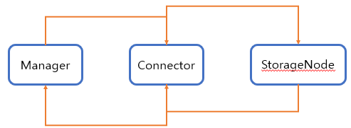

# Storage Client

Connector 모듈은 HttpServer, 즉 API 서버이다.
웹 페이지에서 스토리지 노드로 파일을 업로드하거나 다운로드를 할 때 Connector 모듈의 API에 요청하게 된다.

요청된 데이터는 다시 한번 스토리지 노드에 API 를 통해 실제 파일 업로드 및 다운로드를 요청하게 된다.

최종적으로 웹 페이지에서 커넥터에 요청하고, 커넥터는 스토리지 노드에 요청을 통해 결과를 받아볼 수 있게된다.
